# 🗺️ C4 Diagrams

_Level-by-level blueprints generated from live Mermaid sources._

---

## 1️⃣ Level 1 – System Context

```mermaid
C4Context
    title Uma Upbeat – System Context

    Person(teacher, "Teacher / Facilitator", "Creates and hosts interactive sessions")
    Person(student, "Student / Participant", "Joins sessions from any device")

    System(uma, "Uma Upbeat", "Live quizzes, polls, games – zero-config")

    System_Ext(lms, "LMS / Event Platform", "Canvas, Moodle, Zoom, …")
    System_Ext(ai, "AI Provider (opt-in)", "OpenAI, local LLama, …")

    Rel(teacher, uma, "Publishes @OPENQUIZ blocks")
    Rel(student, uma, "Answers in real-time")
    Rel(uma, lms, "Exports via LTI / API")
    Rel(uma, ai, "Requests enrichment", "HTTPS (if enabled)")
```



---

## 2️⃣ Level 2 – Container Diagram


---

## 3️⃣ Level 3 – API Container Components

```mermaid
C4Component
    title API Container – Component Diagram

    Container(web, "Web Front-end")
    Container(store, "Storage")
    Container(cache, "Redis")

    Component_Boundary(api, "API Server") {
        Component(gql, "GraphQL Module", "HotChocolate", "Queries, Mutations, Subscriptions")
        Component(rest, "REST Module", "Minimal APIs", "Export CSV / LTI")
        Component(auth, "Auth Module", "JWT", "Room-code & OAuth")
        Component(parsers, "Parsers", "Regex / YAML", "Text-first import")
        Component(ai, "AI Service", "LLamaSharp / HTTP", "Prompt enrichment")
    }

    Rel(web, gql, "Query & Sub", "WebSocket")
    Rel(web, rest, "Export endpoints", "HTTPS")
    Rel(gql, auth, "Validate token")
    Rel(gql, parsers, "Import session")
    Rel(gql, ai, "Enrich questions", "If enabled")
    Rel(gql, store, "Persist", "SQL / File")
    Rel(gql, cache, "Publish events", "Redis")
```

---

## 4️⃣ Level 4 – Core Code Snippet (Auth Component)

```csharp
// src/UmaUpbeat.Api/Auth/RoomCodeHandler.cs
public sealed record RoomToken(Guid RoomId, DateTime Expires);

public interface ITokenService {
    string Issue(RoomToken token);
    RoomToken? Validate(string jwt);
}
```

---

## 🎨 Diagram Sources

All diagrams live in this page; copy-paste into [Mermaid Live Editor](https://mermaid.live) to tweak.

---

> “Zoom out for strategy, zoom in for implementation.”
