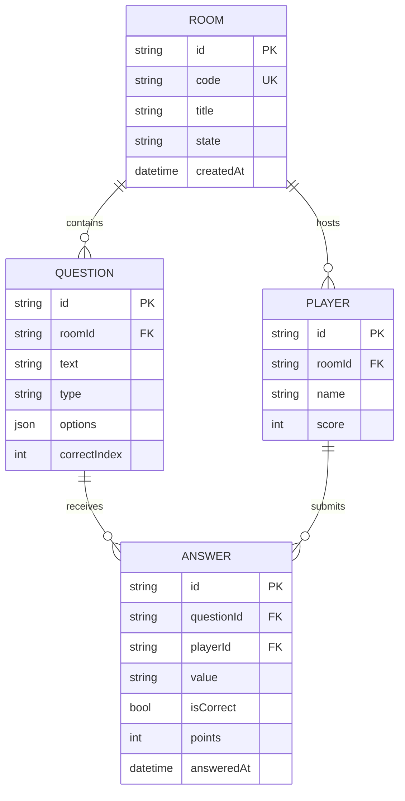

# 🗃️ Data Model

> “One mental model, three physical shapes.”

---

## 1. Conceptual ER Diagram (UML style)



---

## 2. JSON Schema (Draft-07)

<details>
<summary>Room.json</summary>

```json
{
  "$schema": "https://json-schema.org/draft-07/schema#",
  "type": "object",
  "required": ["id", "code", "title", "state", "questions"],
  "properties": {
    "id": { "type": "string", "format": "uuid" },
    "code": { "type": "string", "pattern": "^[A-Z0-9]{4,6}$" },
    "title": { "type": "string", "maxLength": 120 },
    "state": { "enum": ["waiting", "live", "finished"] },
    "questions": { "type": "array", "items": { "$ref": "#/$defs/question" } }
  },
  "$defs": {
    "question": {
      "type": "object",
      "required": ["id", "text", "type", "options"],
      "properties": {
        "id": { "type": "string", "format": "uuid" },
        "text": { "type": "string", "maxLength": 500 },
        "type": { "enum": ["mc", "tf", "scale", "text"] },
        "options": { "type": "array", "items": { "type": "string" } },
        "correctIndex": { "type": "integer", "minimum": 0 }
      }
    }
  }
}
```

</details>

---

## 3. Physical Strategies

| Runtime Mode          | Storage Engine           | File / Table                               | Notes                                |
| --------------------- | ------------------------ | ------------------------------------------ | ------------------------------------ |
| **Edge**              | LiteDB / JSON flat files | `./data/{code}.json`                       | Single file per room; human-readable |
| **Full**              | PostgreSQL + EF Core     | `rooms`, `questions`, `players`, `answers` | Indexed, relational, migrations      |
| **Cache (Full only)** | Redis                    | `room:{code}`, `leaderboard:{code}`        | TTL 24 h, pub/sub events             |

---

## 4. Migrations & Versioning

- **Edge** – no migrations; schema validation on load.
- **Full** – EF Core migrations with rollback.
- **Schema version** stored in every JSON / row (`"schema": 1`).

---

## 5. File Example (Edge mode)

```json
{
  "schema": 1,
  "id": "550e8400-e29b-41d4-a716-446655440000",
  "code": "DEMO",
  "title": "Capitals Quiz",
  "state": "waiting",
  "questions": [
    {
      "id": "123e4567-e89b-12d3-a456-426614174000",
      "text": "Capital of Spain?",
      "type": "mc",
      "options": ["Madrid", "Barcelona", "Valencia"],
      "correctIndex": 0
    }
  ],
  "players": []
}
```

---

## 6. Security & Privacy Flags

| Field          | Purpose                                                 |
| -------------- | ------------------------------------------------------- |
| `room.code`    | Public, 4-6 chars, no PII                               |
| `player.name`  | Voluntary, **NOT persisted** in Edge export             |
| `answer.value` | Encrypted at rest in Full mode if `privacy.strict=true` |

---

## 7. Export / Import Contract

- **Export**: single JSON blob ≤ 256 KB, matches above schema.
- **Import**: same schema validated; **version mismatch** triggers auto-migration prompt.

---

> “One schema to rule them all, three stores to bind them.”
