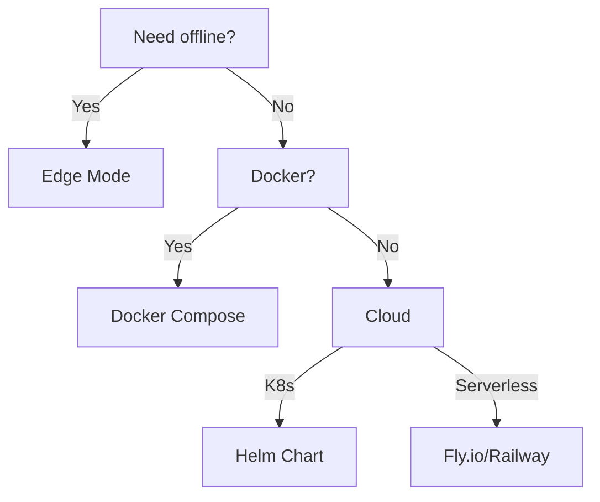

# 🚀 Deployment Topologies

> “One binary, many homes.”

---

## 1. Decision Matrix

| Goal                    | Topology                 | Mode | Skill Needed  |
| ----------------------- | ------------------------ | ---- | ------------- |
| Zero-install demo       | USB stick / local folder | Edge | Copy-paste    |
| Classroom single server | `docker compose up`      | Full | Docker basics |
| University LMS          | Helm chart               | Full | DevOps        |
| Offline workshop        | Raspberry Pi image       | Edge | Flash SD-card |
| SaaS offering           | Managed K8s + CDN        | Full | Cloud-native  |

---

## 2. Edge Mode Recipes

### 2.1 Portable Binary

```bash
# Windows
curl -L https://github.com/UmaUpbeat/uma-upbeat/releases/latest/download/uma-windows-x64.exe -o uma.exe
./uma.exe
# Browse http://localhost:8080
```

### 2.2 Raspberry Pi OS Lite

```bash
sudo apt update && sudo apt install -y wget
wget https://github.com/UmaUpbeat/uma-upbeat/releases/latest/download/uma-linux-arm64
chmod +x uma-linux-arm64
./uma-linux-arm64
```

### 2.3 SD-Card Image (ready-to-boot)

- Download `uma-rpi.img.xz`
- Flash with [Raspberry Pi Imager](https://www.raspberrypi.com/software/)
- Wi-Fi and hotspot auto-configured; serves on `http://192.168.4.1`

---

## 3. Full-Mode Recipes

### 3.1 Docker Compose (One-Liner)

```yaml
# docker-compose.yml
services:
  db:
    image: postgres:16-alpine
    environment:
      POSTGRES_USER: quiz
      POSTGRES_PASSWORD: quiz
  redis:
    image: redis:7-alpine
  app:
    image: ghcr.io/umaupbeat/uma:latest
    ports: ["80:8080"]
    environment:
      POSTGRES_URL: "Host=db;Database=quiz;Username=quiz;Password=quiz"
      REDIS_URL: "redis:6379"
    depends_on: [db, redis]
```

```bash
docker compose up -d
```

### 3.2 Kubernetes (Helm)

```bash
helm repo add uma https://umaupbeat.github.io/charts
helm install my-quiz uma/uma \
  --set postgres.enabled=true \
  --set ingress.enabled=true \
  --set ingress.host=quiz.myschool.edu
```

### 3.3 Cloud-Native SaaS

| Cloud       | Template                 | Notes                        |
| ----------- | ------------------------ | ---------------------------- |
| **Fly.io**  | `fly.toml` + Dockerfile  | Auto-SSL, 1-command deploy   |
| **Railway** | `railway.json`           | Postgres & Redis as services |
| **AWS ECS** | CDK stack in `infra/aws` | Fargate + RDS + ElastiCache  |

---

## 4. Reverse Proxy & TLS

| Mode       | Tool         | Auto-SSL         | Command                             |
| ---------- | ------------ | ---------------- | ----------------------------------- |
| **Docker** | Caddy        | ✅               | `caddy run --config Caddyfile`      |
| **K8s**    | cert-manager | ✅               | `kubectl apply -f cert-issuer.yaml` |
| **Edge**   | Kestrel      | ❌ (self-signed) | `-p 443:8080` with self-signed cert |

---

## 5. Secrets & Environment

### Required Variables (Full)

| Var            | Example                     | Purpose         |
| -------------- | --------------------------- | --------------- |
| `POSTGRES_URL` | `Host=db;Database=quiz;...` | Relational data |
| `REDIS_URL`    | `redis:6379`                | Pub/sub & cache |
| `JWT__KEY`     | 256-bit string              | Token signing   |

### Optional (Edge)

| Var        | Example  | Purpose               |
| ---------- | -------- | --------------------- |
| `DATA_DIR` | `./data` | Override JSON/DB path |
| `PORT`     | `3000`   | Listen port           |

### Secrets Management

| Target             | Method                               |
| ------------------ | ------------------------------------ |
| **Docker Compose** | `.env` + `docker-compose --env-file` |
| **K8s**            | SealedSecrets / Vault                |
| **Edge USB**       | Encrypted USB with LUKS              |

---

## 6. Monitoring & Observability

| Mode     | Stack                | URL                             |
| -------- | -------------------- | ------------------------------- |
| **Full** | Prometheus + Grafana | `https://metrics.myschool.edu`  |
| **Edge** | Health endpoint only | `http://localhost:8080/healthz` |

---

## 7. Zero-Downtime Upgrades

| Topology           | Strategy                                      |
| ------------------ | --------------------------------------------- |
| **Docker Compose** | `docker compose pull && docker compose up -d` |
| **K8s**            | Rolling update via `kubectl rollout restart`  |
| **Edge USB**       | New binary side-by-side; symlink swap         |

---

## 8. Quick Decision Tree



---

> “Deploy where learners are, not where vendors want you to be.”
