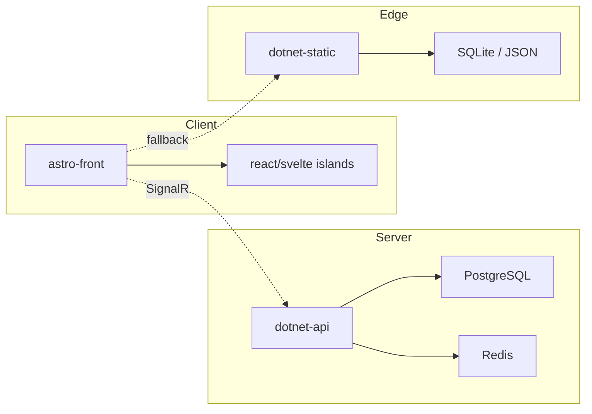

# 🏗️ Architecture Overview

Welcome to the **blueprints** of Uma Upbeat.  
Here you’ll find diagrams, contracts, data models, and deployment patterns — all in one place.

---

## 🗺️ Quick Map

| Page                                                         | What You’ll Learn                           |
| ------------------------------------------------------------ | ------------------------------------------- |
| [System Overview](/architecture/system-overview)             | 30-second elevator pitch of the whole stack |
| [C4 Diagrams](/architecture/c4-diagrams)                     | Context → Containers → Components → Code    |
| [Data Model](/architecture/data-model)                       | ER diagrams, collections, and JSON schemas  |
| [Runtime Modes](/architecture/runtime-modes)                 | Full vs Edge mode internals                 |
| [API Contracts](/architecture/api-contracts)                 | GraphQL SDL, REST, WebSocket sub-protocols  |
| [Security Model](/architecture/security-model)               | Auth, privacy, threat model                 |
| [Deployment Topologies](/architecture/deployment-topologies) | Docker, K8s, static host, offline USB       |

---

## 🧩 Core Building Blocks

---

## 🔍 Where to Start

- **First-timers** → read [System Overview](/architecture/system-overview) (2 min).
- **Backend devs** → jump to [Data Model](/architecture/data-model).
- **DevOps** → open [Deployment Topologies](/architecture/deployment-topologies).

---

> “Architecture is not a destination; it’s a conversation.”
