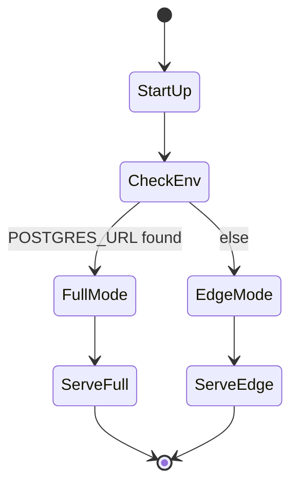

# 🏃‍♂️ Runtime Modes

> “Same heart, two heartbeats.”

---

## 1. Quick Comparison

| Aspect                 | **Full Mode**                  | **Edge Mode**          |
| ---------------------- | ------------------------------ | ---------------------- |
| **Trigger**            | `POSTGRES_URL` env var present | absent                 |
| **Storage**            | PostgreSQL + Redis             | SQLite / LiteDB / JSON |
| **Cache**              | Redis pub/sub & TTL            | in-memory LRU          |
| **Deploy**             | Docker Compose, K8s            | single binary / USB    |
| **Multi-tenant** ✅    | ❌ (single file per room)      |
| **Concurrent Writers** | ✅ (row locks)                 | ⚠️ file locks          |
| **Offline Use**        | ❌                             | ✅                     |
| **Example Command**    | `docker compose up`            | `./uma`                |

---

## 2. Lifecycle Diagram



---

## 3. Startup Sequence

### 3.1 Full Mode

```bash
POSTGRES_URL=postgres://u:p@db/quiz \
REDIS_URL=redis://cache:6379 \
./uma
```

1. Validates connection strings.
2. Runs EF Core migrations.
3. Registers Redis backplane for SignalR.
4. Exposes `/healthz` with `mode=full`.

### 3.2 Edge Mode

```bash
./uma
```

1. Falls back to `./data/*.json` (creates if empty).
2. Uses LiteDB single-file DB (`./data/uma.db`).
3. Starts in-memory pub/sub for local rooms.
4. Exposes `/healthz` with `mode=edge`.

---

## 4. File Layout per Mode

### **Full** (containerised)

```
uma/
├── appsettings.json   # points to DB & Redis
├── migrations/
└── Dockerfile
```

### **Edge** (portable)

```
uma.exe (or uma)
data/
├── rooms/
│   ├── ABCD.json
│   └── EFGH.json
└── uma.db (LiteDB)
```

> Copy the folder to a USB stick; double-click `uma.exe`—no install.

---

## 5. Capability Matrix

| Feature              | Full          | Edge             | Notes                           |
| -------------------- | ------------- | ---------------- | ------------------------------- |
| **Live leaderboard** | ✅ (Redis)    | ✅ (in-mem)      | Edge loses state on restart     |
| **Room sharding**    | ✅            | ❌               | Edge single instance            |
| **Back-ups**         | pg_dump       | zip `./data`     | One-liner backup script         |
| **Scaling**          | K8s HPA       | N/A              | Edge is single-tenant           |
| **SSL termination**  | Traefik/Caddy | built-in Kestrel | Edge auto-generates self-signed |

---

## 6. When to Choose Which

| Use-Case             | Recommended Mode                 |
| -------------------- | -------------------------------- |
| Classroom with Wi-Fi | **Full** (multi-room, analytics) |
| Rural school with 3G | **Edge** (offline + < 3 MB load) |
| University LMS       | **Full** (LTI, SSO)              |
| Conference workshop  | **Edge** (USB hand-out)          |
| CI / Demo            | **Edge** (fastest spin-up)       |

---

## 7. Switching Modes Mid-Flight _(Future)_

RFC-DRAFT:

- **Import** Edge JSON into Full DB via `/admin/import`.
- **Export** Full DB to Edge via `/admin/export`.
- **Zero downtime** switch via blue-green containers.

---

## 8. CLI Helpers

| Command             | Purpose                           |
| ------------------- | --------------------------------- |
| `uma --mode full`   | Force Full (skips auto-detection) |
| `uma --mode edge`   | Force Edge                        |
| `uma --export edge` | Dump current state as Edge bundle |

---

> “Pick the mode that fits the moment, not the marketing.”
