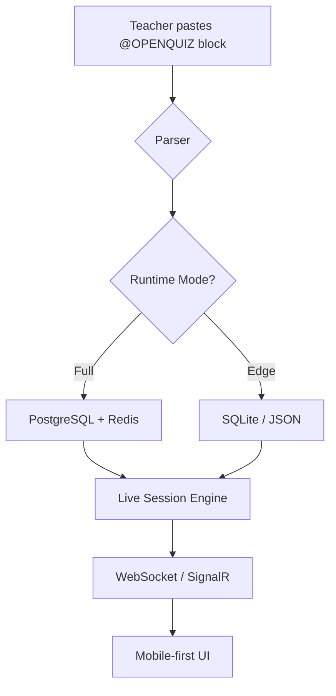

# 🚀 System Overview

_“One engine, two modes, three minutes to launch.”_

---

## 🎯 In One Sentence

Uma Upbeat is a **single binary** that can run either **cloud-scale** (PostgreSQL + Redis) or **offline-from-a-USB** (SQLite / JSON) and instantly turns any plain-text block into live quizzes, polls, or 2.5-D games.

---

## 🔍 High-Level Flow

---

## ⚙️ Components

| Layer         | Tech                        | Purpose                     |
| ------------- | --------------------------- | --------------------------- |
| **Front-end** | Astro + Svelte islands      | Docs, demos, host/player UI |
| **API**       | .NET 8 + HotChocolate       | GraphQL, REST, WebSocket    |
| **Real-time** | SignalR                     | Live quizzes & leaderboards |
| **Storage**   | PostgreSQL / SQLite / JSON  | Questions, answers, scores  |
| **Cache**     | Redis (Full only)           | Pub/sub + TTL rooms         |
| **AI**        | Optional local LLM / OpenAI | Auto-generate questions     |

---

## 🔧 Key Guarantees

| Promise                  | How                                        |
| ------------------------ | ------------------------------------------ |
| **≤ 3 MB mobile bundle** | Lighthouse CI gate                         |
| **60 fps on Moto G7**    | Chrome trace baseline                      |
| **Offline capable**      | Edge mode runs without internet            |
| **Zero-config deploy**   | `docker compose up` or double-click binary |

---

## 🌐 Where Next?

- See [C4 Diagrams](/architecture/c4-diagrams) for deeper layers.
- Browse [Data Model](/architecture/data-model) for entity relationships.
- Jump to [Deployment Topologies](/architecture/deployment-topologies) to host it yourself.

---

> “Complexity hidden, simplicity delivered.”
